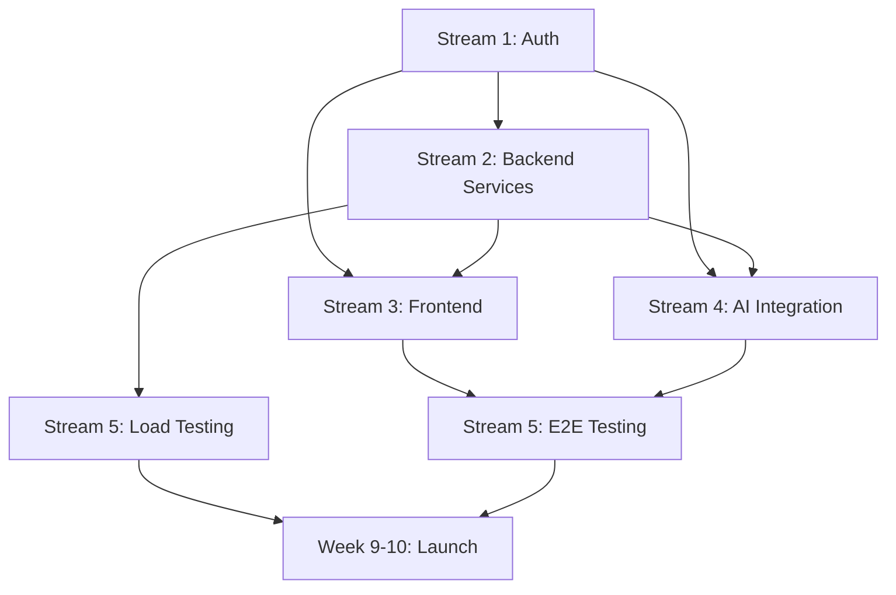

# Parallel Work Plan - Intelligent Workflows MVP Completion

**Target**: Production-ready MVP in 10 weeks
**Current Progress**: ~42% complete
**Team Size**: 3-4 engineers
**Last Updated**: 2025-11-05

---

## Overview

This plan organizes remaining work into 6 parallel work streams that can be executed concurrently by different team members. Each stream has clear deliverables, dependencies, and timeline.

---

## 🎯 Work Streams

### Stream 1: Security & Auth Foundation 🔐
**Owner**: Backend Engineer
**Priority**: P0 (Critical - Blocks many features)
**Duration**: 2 weeks
**Effort**: 80 hours

**Why Parallel**: Foundational - other streams need this but can start with mock auth

#### Week 1: Authentication System
- [ ] JWT token generation and validation
- [ ] User model and repository
- [ ] Login/logout endpoints
- [ ] Password hashing (bcrypt)
- [ ] Refresh token mechanism
- [ ] Auth middleware for protected routes

**Deliverables**:
```go
// internal/auth/jwt.go
type JWTManager interface {
    GenerateToken(userID uuid.UUID, role string) (string, error)
    ValidateToken(token string) (*Claims, error)
    RefreshToken(refreshToken string) (string, error)
}

// internal/api/rest/middleware/auth.go
func Authenticate() func(http.Handler) http.Handler
func RequireRole(roles ...string) func(http.Handler) http.Handler
```

#### Week 2: Authorization & Security
- [ ] Role-based access control (RBAC)
- [ ] Permission system (create/read/update/delete workflows)
- [ ] Rate limiting middleware (per user, per IP)
- [ ] CORS configuration from environment
- [ ] API key authentication for AI agents
- [ ] Audit logging integration

**Deliverables**:
```go
// internal/auth/rbac.go
type Permission string
const (
    PermWorkflowCreate Permission = "workflow:create"
    PermWorkflowRead   Permission = "workflow:read"
    // ... etc
)

// internal/api/rest/middleware/ratelimit.go
func RateLimit(requests int, window time.Duration) func(http.Handler) http.Handler
```

**Testing**:
- [ ] Unit tests for JWT validation
- [ ] Integration tests for auth flow
- [ ] E2E tests for protected endpoints

**Dependencies**: None (can start immediately)

---

### Stream 2: Backend Services Completion 🔧
**Owner**: Backend Engineer
**Priority**: P0 (Critical)
**Duration**: 3 weeks
**Effort**: 120 hours

**Why Parallel**: Core functionality needed for all workflows

#### Week 1: Approval Flow & Notifications
- [ ] Notification service (email, Slack, webhook)
- [ ] Email templates for approvals
- [ ] Approval notification sending (fix TODO at approval_service.go:75)
- [ ] Workflow resumption after approval (fix TODO at approval_service.go:119)
- [ ] Approval expiration job
- [ ] Approval webhook callbacks

**Deliverables**:
```go
// internal/services/notification_service.go
type NotificationService interface {
    SendEmail(to []string, template string, data map[string]interface{}) error
    SendSlack(channel string, message string) error
    SendWebhook(url string, payload interface{}) error
}

// internal/services/approval_service.go
func (s *ApprovalService) SendNotifications(approval *ApprovalRequest) error
func (s *ApprovalService) ResumeWorkflow(approvalID uuid.UUID) error
```

**Config**:
```yaml
notifications:
  email:
    smtp_host: smtp.example.com
    smtp_port: 587
    from: workflows@example.com
  slack:
    webhook_url: ${SLACK_WEBHOOK_URL}
```

#### Week 2: Context Loading & Integrations
- [ ] Integration framework (fix TODO at context.go:81)
- [ ] HTTP client with retry/circuit breaker
- [ ] Context resource loaders (orders, customers, products)
- [ ] Caching strategy for context data
- [ ] Integration registry
- [ ] Mock integrations for testing

**Deliverables**:
```go
// internal/integrations/framework.go
type Integration interface {
    Name() string
    Load(ctx context.Context, entityType, entityID string) (map[string]interface{}, error)
}

// internal/integrations/registry.go
type Registry struct {
    integrations map[string]Integration
}

// internal/integrations/orders/client.go
type OrdersIntegration struct {
    baseURL string
    client  *http.Client
}

func (i *OrdersIntegration) Load(ctx context.Context, entityType, entityID string) (map[string]interface{}, error)
```

#### Week 3: Background Worker & Scheduling
- [ ] Worker service (`cmd/worker/main.go`)
- [ ] Job queue (Redis-based)
- [ ] Cron job scheduler (fix TODO at event_router.go:187)
- [ ] Scheduled workflow execution
- [ ] Delayed job processing
- [ ] Worker health checks

**Deliverables**:
```go
// cmd/worker/main.go
func main() {
    // Worker process that consumes jobs from Redis queue
}

// internal/jobs/scheduler.go
type Scheduler interface {
    ScheduleCron(workflowID uuid.UUID, cronExpr string) error
    ScheduleAt(workflowID uuid.UUID, executeAt time.Time) error
    Cancel(jobID uuid.UUID) error
}
```

**Testing**:
- [ ] Integration tests for notification service
- [ ] Mock integration tests
- [ ] Worker job processing tests

**Dependencies**:
- Partial dependency on Stream 1 (auth for webhook callbacks)
- Can start weeks 1-2 immediately with mock auth

---

### Stream 3: Frontend Development 🎨
**Owner**: Frontend Engineer
**Priority**: P0 (Critical - User-facing)
**Duration**: 4 weeks
**Effort**: 160 hours

**Why Parallel**: Independent of backend work once APIs exist

#### Week 1: Workflow Management UI
- [ ] Workflow creation form (form-based, not visual yet)
- [ ] Step builder components (Condition, Action, Execute)
- [ ] Workflow detail page
- [ ] Workflow edit page
- [ ] Enable/disable toggle
- [ ] Delete confirmation modal

**Deliverables**:
```typescript
// src/pages/WorkflowCreatePage.tsx
// Form with:
// - Basic info (name, description, tags)
// - Trigger configuration
// - Step builder (add/remove/reorder steps)
// - JSON preview pane

// src/components/workflow/StepBuilder.tsx
// Components for each step type:
// - ConditionStep
// - ActionStep
// - ParallelStep
// - ExecuteStep
```

**Pages**:
- `/workflows/new` - Create workflow
- `/workflows/:id` - View workflow details
- `/workflows/:id/edit` - Edit workflow

#### Week 2: Execution Monitoring
- [ ] Execution detail page with step trace
- [ ] Step execution timeline
- [ ] Execution status indicators
- [ ] Filter and search executions
- [ ] Execution retry button
- [ ] Export execution data

**Deliverables**:
```typescript
// src/pages/ExecutionDetailPage.tsx
// Shows:
// - Execution metadata
// - Step-by-step trace with timing
// - Context data viewer
// - Error messages
// - Visual flow diagram (optional)

// src/components/execution/StepTrace.tsx
// Timeline showing each step execution
```

**Pages**:
- `/executions/:id` - Execution detail with full trace

#### Week 3: Approvals Dashboard
- [ ] Approval queue with filters
- [ ] Approval detail modal
- [ ] Approve/reject actions
- [ ] Approval history
- [ ] Pending approvals count badge
- [ ] Email notification links

**Deliverables**:
```typescript
// src/pages/ApprovalsPage.tsx (enhance existing)
// - Filter by status (pending/approved/rejected)
// - Sort by date, priority
// - Bulk actions

// src/components/approval/ApprovalDetailModal.tsx
// - Entity details
// - Requester info
// - Approve/reject form with reason
// - Related workflow/execution links
```

#### Week 4: Analytics & Real-time Updates
- [ ] Analytics dashboard with charts
- [ ] Workflow execution metrics
- [ ] Success/failure rates
- [ ] Average execution time
- [ ] WebSocket connection for live updates
- [ ] Real-time execution status updates
- [ ] Toast notifications for important events

**Deliverables**:
```typescript
// src/pages/AnalyticsPage.tsx (implement)
// Charts:
// - Executions over time (line chart)
// - Success vs Failed (pie chart)
// - Top workflows (bar chart)
// - Average duration (metric cards)

// src/lib/websocket.ts
// WebSocket connection manager
// Subscribe to execution updates

// src/components/realtime/ExecutionUpdates.tsx
// Live feed of execution status changes
```

**Testing**:
- [ ] Component tests (Vitest + React Testing Library)
- [ ] E2E tests (Playwright/Cypress)
- [ ] Accessibility testing

**Dependencies**:
- API endpoints from Stream 2 (can use mock data initially)
- WebSocket from Stream 5 (can implement polling first)

---

### Stream 4: AI Integration 🤖
**Owner**: Full-stack Engineer with AI experience
**Priority**: P1 (High - Key differentiator)
**Duration**: 3 weeks
**Effort**: 120 hours

**Why Parallel**: Self-contained feature with clear API boundaries

#### Week 1: AI Service Foundation
- [ ] LLM client abstraction (OpenAI, Anthropic)
- [ ] Prompt templates
- [ ] Capability discovery endpoint
- [ ] Workflow schema documentation for AI
- [ ] Token usage tracking
- [ ] Error handling for AI failures

**Deliverables**:
```go
// internal/ai/client.go
type LLMClient interface {
    Complete(ctx context.Context, systemPrompt, userPrompt string) (string, error)
    CompleteJSON(ctx context.Context, systemPrompt, userPrompt string, schema interface{}) error
}

// internal/ai/service.go
type AIService struct {
    llmClient LLMClient
    logger    *logger.Logger
}

// GET /api/v1/ai/capabilities
{
  "entities": ["order", "cart", "product", "quote"],
  "operators": ["eq", "neq", "gt", "gte", "lt", "lte", "in", "contains"],
  "actions": ["allow", "block", "execute"],
  "execute_types": ["notify", "webhook", "create_record"]
}
```

#### Week 2: Natural Language Interpreter
- [ ] Prompt engineering for workflow generation
- [ ] Natural language to workflow converter
- [ ] Validation of AI-generated workflows
- [ ] Confidence scoring
- [ ] Few-shot examples in prompts
- [ ] Workflow suggestion endpoint

**Deliverables**:
```go
// internal/ai/interpreter.go
type Interpreter struct {
    aiService *AIService
    validator *Validator
}

func (i *Interpreter) InterpretPrompt(ctx context.Context, prompt string) (*WorkflowSuggestion, error)

// POST /api/v1/ai/interpret
Request:
{
  "prompt": "Block orders over $5000 from new customers",
  "context": {
    "available_entities": ["order", "customer"]
  }
}

Response:
{
  "interpretation": {
    "action": "create_workflow",
    "trigger": "order.checkout.initiated",
    "conditions": [...],
    "actions": [...]
  },
  "suggested_workflow": { ... },
  "confidence": 0.95,
  "explanation": "This workflow will..."
}
```

**System Prompt Template**:
```markdown
You are an AI assistant that converts natural language descriptions into workflow definitions.

Available entities: {entities}
Available operators: {operators}
Available actions: {actions}

Workflow schema:
{workflow_schema}

Examples:
{few_shot_examples}

Convert the following request into a valid workflow definition:
{user_prompt}

Respond with JSON only.
```

#### Week 3: AI Agent API & Validation
- [ ] Workflow validation endpoint
- [ ] AI agent authentication (API keys)
- [ ] Usage tracking and quotas
- [ ] Workflow testing endpoint
- [ ] AI-friendly error messages
- [ ] Documentation for AI agents

**Deliverables**:
```go
// POST /api/v1/ai/validate
// Validates workflow definition and provides feedback

// POST /api/v1/ai/test
// Test a workflow with sample data

// internal/auth/apikey.go
// API key authentication for AI agents
type APIKey struct {
    Key       string
    AgentID   string
    AgentType string // "openai", "claude", "custom"
    RateLimit int
}
```

**AI Agent Documentation**:
```markdown
# AI Agent API Guide

## Authentication
Use API keys with `X-API-Key` header.

## Endpoints
- POST /api/v1/ai/interpret - Convert natural language to workflow
- POST /api/v1/ai/validate - Validate workflow definition
- POST /api/v1/ai/capabilities - Get available options
- POST /api/v1/ai/test - Test workflow with sample data

## Example Usage
[Code examples for Python, JavaScript, etc.]
```

**Testing**:
- [ ] Unit tests with mocked LLM responses
- [ ] Integration tests with real API calls
- [ ] Prompt effectiveness testing
- [ ] Edge case handling (ambiguous prompts)

**Dependencies**:
- Stream 1 for API key auth (can use basic auth initially)
- Core engine from Stream 2 (already complete)

**Cost Considerations**:
- OpenAI API costs: ~$0.01-0.05 per workflow generation
- Implement caching for similar prompts
- Rate limiting per user

---

### Stream 5: Production Infrastructure 🚀
**Owner**: DevOps Engineer (part-time)
**Priority**: P1 (Required for deployment)
**Duration**: 4 weeks (spread over 10 weeks)
**Effort**: 80 hours

**Why Parallel**: Infrastructure can be built while features are developed

#### Week 1-2: CI/CD Pipeline
- [ ] GitHub Actions workflow for Go tests
- [ ] Frontend build and test workflow
- [ ] Docker image building
- [ ] Container registry push
- [ ] Automated migrations
- [ ] Deployment to staging
- [ ] Integration test suite in CI

**Deliverables**:
```yaml
# .github/workflows/backend-ci.yml
name: Backend CI
on: [push, pull_request]
jobs:
  test:
    runs-on: ubuntu-latest
    steps:
      - uses: actions/checkout@v3
      - uses: actions/setup-go@v4
      - run: go test -v -race -coverprofile=coverage.out ./...
      - run: go test -tags=integration ./tests/integration/...

  build:
    runs-on: ubuntu-latest
    steps:
      - uses: docker/build-push-action@v5
        with:
          push: true
          tags: ${{ secrets.REGISTRY }}/workflows:${{ github.sha }}

# .github/workflows/frontend-ci.yml
name: Frontend CI
on: [push, pull_request]
jobs:
  test:
    runs-on: ubuntu-latest
    steps:
      - run: npm test
      - run: npm run build

# .github/workflows/deploy-staging.yml
# Automated deployment to staging on main branch
```

#### Week 3-4: Monitoring & Observability
- [ ] Prometheus metrics integration
- [ ] Custom metrics (execution_count, execution_duration, etc.)
- [ ] Grafana dashboard setup
- [ ] Alert rules configuration
- [ ] Jaeger tracing integration
- [ ] Log aggregation (ELK or Loki)
- [ ] Health check improvements

**Deliverables**:
```go
// internal/observability/metrics.go
var (
    ExecutionsTotal = prometheus.NewCounterVec(
        prometheus.CounterOpts{
            Name: "workflow_executions_total",
            Help: "Total number of workflow executions",
        },
        []string{"workflow_id", "status"},
    )

    ExecutionDuration = prometheus.NewHistogramVec(
        prometheus.HistogramOpts{
            Name:    "workflow_execution_duration_seconds",
            Help:    "Workflow execution duration in seconds",
            Buckets: prometheus.DefBuckets,
        },
        []string{"workflow_id"},
    )
)

// internal/observability/tracing.go
// Jaeger tracer setup
func InitTracer(serviceName string) (opentracing.Tracer, io.Closer, error)
```

**Alert Rules**:
```yaml
# monitoring/alerts/workflow_alerts.yml
groups:
  - name: workflow_alerts
    interval: 30s
    rules:
      - alert: HighFailureRate
        expr: rate(workflow_executions_total{status="failed"}[5m]) > 0.1
        annotations:
          summary: "High workflow failure rate detected"

      - alert: SlowExecutions
        expr: histogram_quantile(0.95, workflow_execution_duration_seconds) > 30
        annotations:
          summary: "95th percentile execution time > 30s"
```

#### Week 5-6: Performance & Load Testing
- [ ] Load testing with k6 or Locust
- [ ] Performance benchmarks
- [ ] Database query optimization
- [ ] Redis caching optimization
- [ ] Connection pooling tuning
- [ ] Stress testing scenarios

**Deliverables**:
```javascript
// tests/load/workflow_load_test.js
import http from 'k6/http';
import { check, sleep } from 'k6';

export let options = {
  stages: [
    { duration: '2m', target: 100 },  // Ramp up to 100 users
    { duration: '5m', target: 100 },  // Stay at 100 users
    { duration: '2m', target: 200 },  // Ramp up to 200 users
    { duration: '5m', target: 200 },  // Stay at 200 users
    { duration: '2m', target: 0 },    // Ramp down
  ],
  thresholds: {
    http_req_duration: ['p(95)<500'], // 95% of requests under 500ms
    http_req_failed: ['rate<0.01'],   // Error rate < 1%
  },
};

export default function() {
  // Test workflow execution
  let payload = JSON.stringify({
    event_type: 'order.created',
    payload: { order: { total: 15000 } }
  });

  let res = http.post(`${BASE_URL}/api/v1/events`, payload, {
    headers: { 'Content-Type': 'application/json' },
  });

  check(res, {
    'status is 202': (r) => r.status === 202,
    'response time < 500ms': (r) => r.timings.duration < 500,
  });

  sleep(1);
}
```

**Performance Targets**:
- 10,000+ executions/day ✓
- 95th percentile response time < 500ms
- 99.9% uptime
- Support 100 concurrent workflows

#### Week 7-8: Deployment & Operations
- [ ] Kubernetes deployment automation
- [ ] Helm charts
- [ ] Database backup automation
- [ ] Disaster recovery procedures
- [ ] Runbooks for common operations
- [ ] Security scanning in CI
- [ ] Secrets management (Vault/AWS Secrets)

**Deliverables**:
```yaml
# k8s/helm/workflows/Chart.yaml
apiVersion: v2
name: intelligent-workflows
version: 1.0.0

# k8s/helm/workflows/values.yaml
replicaCount: 3
image:
  repository: registry.example.com/workflows
  tag: latest
autoscaling:
  enabled: true
  minReplicas: 3
  maxReplicas: 10
  targetCPUUtilizationPercentage: 70
```

**Runbooks**:
- Database recovery
- Scaling procedures
- Rollback procedures
- Incident response
- Common troubleshooting

**Testing**:
- [ ] Load tests pass with 10,000 req/day
- [ ] Deployment works in staging
- [ ] Monitoring alerts trigger correctly
- [ ] Backup/restore tested

**Dependencies**:
- Can start immediately (parallel infrastructure work)
- Stream 1-2 completion needed for realistic load testing

---

### Stream 6: Developer Experience & Documentation 📚
**Owner**: Technical Writer / Full-stack Engineer
**Priority**: P2 (Important but not blocking)
**Duration**: 3 weeks (spread over 10 weeks)
**Effort**: 60 hours

**Why Parallel**: Documentation can be written as features are developed

#### Week 1-2: API Documentation
- [ ] OpenAPI/Swagger specification
- [ ] Swagger UI setup
- [ ] API authentication docs
- [ ] Request/response examples
- [ ] Error code documentation
- [ ] Postman collection

**Deliverables**:
```yaml
# api/openapi.yaml
openapi: 3.0.0
info:
  title: Intelligent Workflows API
  version: 1.0.0
  description: API-first workflow orchestration platform

servers:
  - url: https://api.workflows.example.com/v1
    description: Production
  - url: http://localhost:8080/api/v1
    description: Local development

paths:
  /workflows:
    get:
      summary: List workflows
      parameters:
        - name: enabled
          in: query
          schema:
            type: boolean
      responses:
        '200':
          description: List of workflows
          content:
            application/json:
              schema:
                type: array
                items:
                  $ref: '#/components/schemas/Workflow'
    # ... etc
```

**Swagger UI**:
- Accessible at `/api/docs`
- Interactive API testing
- Authentication support

#### Week 3-4: Developer Guides
- [ ] Getting started guide (update existing)
- [ ] Workflow authoring guide
- [ ] Integration guide (connecting microservices)
- [ ] CLI usage guide (update existing)
- [ ] Testing guide (update existing)
- [ ] AI agent integration guide
- [ ] Deployment guide

**Deliverables**:
```markdown
# docs/guides/workflow-authoring.md
# Workflow Authoring Guide

## Introduction
Learn how to create workflows using JSON definitions...

## Basic Workflow Structure
...

## Step Types
### Condition Steps
### Action Steps
### Parallel Steps

## Best Practices
...

## Testing Your Workflow
...

# docs/guides/ai-agent-integration.md
# AI Agent Integration Guide

## Overview
How to integrate AI agents with the Workflows API...

## Authentication
...

## Natural Language Workflow Creation
...

## Example: OpenAI Integration
```python
import openai
import requests

# Convert user intent to workflow
def create_workflow_from_intent(intent):
    # Use Workflows AI API
    response = requests.post(
        'https://api.workflows.example.com/v1/ai/interpret',
        json={'prompt': intent},
        headers={'X-API-Key': API_KEY}
    )
    ...
```

#### Week 5-6: Video Tutorials & Examples
- [ ] "Getting Started" video (5 min)
- [ ] "Creating Your First Workflow" video (10 min)
- [ ] "AI-Powered Workflow Creation" video (8 min)
- [ ] Advanced example workflows
- [ ] Use case documentation
- [ ] FAQ documentation

**Deliverables**:
- YouTube channel with tutorials
- 10+ example workflows with explanations
- Comprehensive FAQ

**Testing**:
- [ ] Documentation review by external developer
- [ ] API examples tested and working
- [ ] Video walkthroughs accurate

**Dependencies**:
- Features must be complete for documentation
- Can write drafts in parallel

---

## 📅 Execution Timeline

### Week-by-Week Breakdown

```
Week 1-2: Foundation Sprint
├── Stream 1: Auth System                    [Backend Eng 1]
├── Stream 2: Notifications & Approval       [Backend Eng 2]
├── Stream 3: Workflow UI Forms              [Frontend Eng]
├── Stream 4: AI Service Setup               [Full-stack Eng]
├── Stream 5: CI/CD Pipeline                 [DevOps - 20h]
└── Stream 6: API Docs Draft                 [Tech Writer - 10h]

Week 3-4: Core Features Sprint
├── Stream 1: ✅ COMPLETE
├── Stream 2: Context Loading & Integrations [Backend Eng 1]
├── Stream 3: Execution Monitoring UI        [Frontend Eng]
├── Stream 4: NL Interpreter                 [Full-stack Eng]
├── Stream 5: Monitoring Setup               [DevOps - 20h]
└── Stream 6: Developer Guides               [Tech Writer - 15h]

Week 5-6: Advanced Features Sprint
├── Stream 2: Background Worker & Scheduling [Backend Eng 1]
├── Stream 3: Approvals Dashboard            [Frontend Eng]
├── Stream 4: AI Validation & Agent API      [Full-stack Eng]
├── Stream 5: Load Testing                   [DevOps - 20h]
└── Stream 6: Video Tutorials                [Tech Writer - 15h]

Week 7-8: Polish & Integration Sprint
├── Stream 2: ✅ COMPLETE
├── Stream 3: Analytics & Real-time          [Frontend Eng]
├── Stream 4: ✅ COMPLETE
├── Stream 5: Deployment Automation          [DevOps - 20h]
├── Integration Testing                       [All Engineers]
└── Bug Fixes & Refinement                   [All Engineers]

Week 9-10: Final Sprint & Launch Prep
├── Stream 3: ✅ COMPLETE
├── Stream 5: Security Scanning & Runbooks   [DevOps - 20h]
├── Stream 6: ✅ COMPLETE
├── End-to-End Testing                       [All Engineers]
├── Security Audit                           [Backend Eng 1]
├── Performance Optimization                 [Backend Eng 2]
├── User Acceptance Testing                  [Frontend Eng]
└── Production Deployment                    [DevOps + All]
```

---

## 👥 Team Composition & Roles

### Option A: 4-Person Team (Recommended)

**Backend Engineer 1** (Stream 1 → Stream 2)
- Weeks 1-2: Authentication & Security
- Weeks 3-4: Context Loading & Integrations
- Weeks 5-6: Background Worker & Scheduling
- Weeks 7-10: Security audit, performance optimization

**Backend Engineer 2** (Stream 2)
- Weeks 1-2: Notifications & Approval Flow
- Weeks 3-4: Integration Framework
- Weeks 5-6: Worker Service Support
- Weeks 7-10: API hardening, bug fixes

**Frontend Engineer** (Stream 3)
- Weeks 1-2: Workflow Management UI
- Weeks 3-4: Execution Monitoring
- Weeks 5-6: Approvals Dashboard
- Weeks 7-8: Analytics & Real-time
- Weeks 9-10: UAT, polish, bug fixes

**Full-stack Engineer** (Stream 4)
- Weeks 1-2: AI Service Foundation
- Weeks 3-4: Natural Language Interpreter
- Weeks 5-6: AI Validation & Agent API
- Weeks 7-10: Integration support, documentation

**DevOps Engineer** (Stream 5 - Part-time 20h/week)
- Weeks 1-2: CI/CD Pipeline (40h)
- Weeks 3-4: Monitoring Setup (40h)
- Weeks 5-6: Load Testing (40h)
- Weeks 7-8: Deployment Automation (40h)
- Weeks 9-10: Security & Launch (40h)

**Technical Writer** (Stream 6 - Part-time 10h/week)
- Weeks 1-4: API Documentation (40h)
- Weeks 5-6: Developer Guides (20h)
- Weeks 7-10: Videos & Examples (40h)

### Option B: 3-Person Team (Minimum Viable)

Merge Backend Engineers 1 & 2 into one role (requires 60h weeks or extend timeline by 2 weeks)

---

## 🔗 Dependencies Map



**Critical Path**: Stream 1 → Stream 2 → Stream 5 (Load Testing) → Launch

**Parallel Paths**:
- Stream 3 (Frontend) can work with mock data
- Stream 4 (AI) independent until integration
- Stream 6 (Docs) fully parallel

---

## 🎯 Milestones & Gates

### Milestone 1: Authentication Complete (End of Week 2)
**Gate Criteria**:
- [ ] JWT auth working end-to-end
- [ ] Protected endpoints require auth
- [ ] Rate limiting functional
- [ ] Integration tests passing

**Risk**: Blocks other streams if delayed
**Mitigation**: Start this immediately, consider it P0

### Milestone 2: Core Backend Complete (End of Week 6)
**Gate Criteria**:
- [ ] Notifications sending successfully
- [ ] Approval flow working end-to-end
- [ ] Context loading from external services
- [ ] Background worker processing jobs
- [ ] Scheduled workflows executing

**Risk**: Frontend has limited functionality without this
**Mitigation**: Frontend builds with mock data in parallel

### Milestone 3: Feature Complete (End of Week 8)
**Gate Criteria**:
- [ ] All UI pages functional
- [ ] AI integration working
- [ ] All API endpoints complete
- [ ] CI/CD pipeline operational
- [ ] Monitoring dashboards live

**Risk**: Integration issues between components
**Mitigation**: Weekly integration testing, clear API contracts

### Milestone 4: Production Ready (End of Week 10)
**Gate Criteria**:
- [ ] Load tests passing (10,000+ executions/day)
- [ ] Security audit complete
- [ ] All E2E tests passing
- [ ] Documentation complete
- [ ] Deployment runbooks ready
- [ ] Production environment configured

**Risk**: Performance or security issues found late
**Mitigation**: Start load testing in Week 5, continuous security review

---

## 📊 Success Metrics

### Technical Metrics
- **Test Coverage**: >80% for backend, >70% for frontend
- **API Response Time**: 95th percentile < 500ms
- **Throughput**: Support 10,000+ executions/day
- **Availability**: 99.9% uptime
- **Error Rate**: < 1% failed executions

### Feature Completeness
- **Phase 1**: 95% → 100% ✓
- **Phase 2**: 85% → 100% ✓
- **Phase 3**: 50% → 100% ✓
- **Phase 4**: 0% → 90% (excluding advanced AI features)
- **Phase 5**: 30% → 95% (excluding visual builder)
- **Phase 6**: 40% → 85%
- **Phase 7**: 5% → 90%

**Target Overall Completion**: 95% (from current 42%)

### Business Metrics
- **User Workflows**: At least 10 workflows created in beta
- **AI Usage**: 50%+ of workflows created via AI
- **Documentation**: Developer can onboard in < 2 hours

---

## ⚠️ Risks & Mitigation

### Risk 1: AI Integration Complexity
**Impact**: High - Key differentiator
**Probability**: Medium
**Mitigation**:
- Start simple with GPT-4 or Claude
- Pre-write prompt templates
- Budget for API costs ($500/month for testing)
- Have fallback: manual workflow creation works fine

### Risk 2: Performance Not Meeting Targets
**Impact**: High - Production blocker
**Probability**: Medium
**Mitigation**:
- Start load testing in Week 5 (not Week 9)
- Database query optimization early
- Redis caching strategy
- Connection pool tuning
- Consider read replicas if needed

### Risk 3: Frontend Complexity (Visual Builder)
**Impact**: Medium - Nice-to-have, not MVP
**Probability**: High
**Mitigation**:
- **DEFER visual builder to post-MVP**
- Form-based workflow creation is sufficient for MVP
- Visual builder is 4-6 week project alone

### Risk 4: Integration with External Services
**Impact**: Medium - Limits workflow usefulness
**Probability**: Medium
**Mitigation**:
- Start with mock integrations
- Build integration framework with retry/circuit breaker
- Document clear integration contract
- Partner services can integrate post-launch

### Risk 5: Timeline Slippage
**Impact**: Medium - Delayed launch
**Probability**: Medium
**Mitigation**:
- Weekly standups with blocker discussion
- Bi-weekly demos to stakeholders
- Feature flags for incomplete features
- Can launch without AI if needed (though not ideal)

---

## 🚀 Launch Criteria

### Must Have (Blockers)
- [ ] Authentication & authorization working
- [ ] Workflows can be created via UI and API
- [ ] Workflow execution engine reliable
- [ ] Approval flow complete
- [ ] Basic monitoring in place
- [ ] Security audit passed
- [ ] Load tests passed
- [ ] Documentation complete

### Should Have (Launch with caveats)
- [ ] AI integration working (can launch without, but should have)
- [ ] Real-time updates (can use polling initially)
- [ ] Analytics dashboard (can be basic)
- [ ] Cron scheduling (can defer if needed)

### Nice to Have (Post-MVP)
- Visual workflow builder
- Advanced AI features (workflow optimization)
- Mobile app
- Workflow marketplace
- A/B testing
- GraphQL API
- MongoDB support

---

## 📝 Communication Plan

### Daily Standups (15 min)
- What did you complete yesterday?
- What are you working on today?
- Any blockers?

### Weekly Demos (1 hour, Fridays)
- Each stream shows progress
- Integration testing
- Identify blockers for next week

### Bi-weekly Sprint Planning (2 hours)
- Review previous sprint
- Plan next 2 weeks
- Adjust priorities if needed

### Documentation
- Update this plan weekly with actual progress
- Track time vs. estimates
- Document blockers and resolutions

---

## 🎓 Onboarding New Engineers

If additional engineers join mid-stream:

**Week 1-2 Joiner**: Can take over Stream 6 (Docs)
**Week 3-4 Joiner**: Can help with Stream 3 (Frontend) or Stream 5 (Testing)
**Week 5+ Joiner**: Focus on testing, bug fixes, polish

---

## 📈 Post-MVP Roadmap (Week 11+)

Once MVP launches, prioritize based on user feedback:

**High Value, Low Effort**:
- Visual workflow builder (if requested heavily)
- More AI features (workflow optimization)
- Additional integrations

**High Value, High Effort**:
- Workflow versioning & rollback
- A/B testing for workflows
- Advanced analytics & ML insights

**Low Value, Low Effort**:
- Additional workflow step types
- More notification channels
- UI polish

---

## ✅ Next Immediate Actions

### This Week (Week 1)
1. **Set up project management** (Jira, Linear, or GitHub Projects)
2. **Create branches** for each work stream
3. **Assign engineers** to streams
4. **Schedule standups** and demos
5. **Start Stream 1** (Auth) immediately - highest priority
6. **Start other streams** with mock auth

### Quick Wins (Complete in 1-2 days)
- Fix all TODO comments with simple solutions
- Add version from config (health.go:44,86)
- Configure CORS from environment (router.go:34)
- Add basic audit log population

---

## 💡 Success Tips

1. **Communicate Early and Often**: Daily standups are critical
2. **Integration Test Weekly**: Don't wait until Week 8
3. **Use Feature Flags**: Ship incomplete features behind flags
4. **Document as You Go**: Don't defer docs to the end
5. **Celebrate Milestones**: Team morale matters
6. **Be Realistic**: If timeline slips, cut scope, not quality
7. **User Feedback Early**: Beta test in Week 7-8

---

**Let's ship this! 🚀**

Target Launch Date: **10 weeks from today**
Target Completion: **95% MVP features**
Success Probability: **High** (with 4-person team following this plan)
